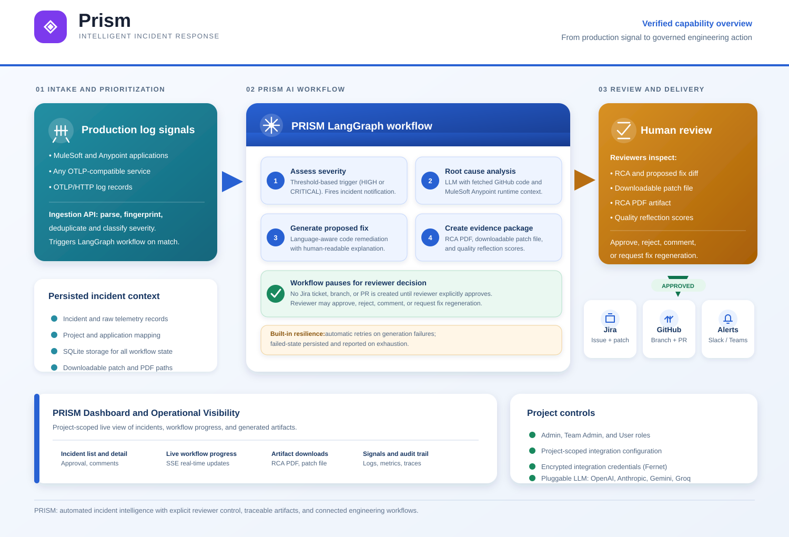

# PRISM Leadership Review Summary

**PRISM** is an AI-powered incident management platform that converts production error signals into a structured, reviewable engineering response. It accepts OpenTelemetry (OTLP) logs from MuleSoft/Anypoint applications and other OTLP-compatible services, parses and deduplicates incoming errors, classifies their severity, and records incident and telemetry context for investigation.

For incidents that meet the configured severity threshold, **PRISM** executes a stateful LangGraph workflow. The implemented workflow assesses severity; generates an AI-assisted root cause analysis using available GitHub code and MuleSoft runtime context; proposes a code fix and explanation; creates an RCA PDF and downloadable patch file; and performs a quality reflection against correctness, safety, code quality, and completeness criteria. **This gives engineering teams a consistent evidence package before they decide how to act.**

A core strength of **PRISM** is its explicit **human-in-the-loop governance**. The workflow pauses before downstream delivery actions. Reviewers can examine the RCA, proposed fix, generated patch, PDF report, and quality scores; add comments; approve or reject the recommendation; or request a regenerated fix with feedback. **Jira issue creation and GitHub branch/pull-request creation occur only after approval.** PRISM therefore assists engineering work without bypassing accountability or code-review controls.

After approval, PRISM can send configured Slack or Microsoft Teams notifications, create a Jira issue with the patch attached, and create a GitHub branch, commit, and pull request. These integrations are project-configurable, enabling the platform to fit existing delivery processes rather than requiring teams to change their engineering toolchain.

The PRISM dashboard provides project-scoped access to incident lists and incident details, workflow progress, root-cause and fix artifacts, comments, and approval decisions. It also provides UI areas for telemetry logs, service health, traces, metrics, API analytics, and audit records. Administration capabilities support project onboarding, role-based access for Admin, Team Admin, and User roles, team management, application-to-repository mappings, and per-project integration setup.

**Important enterprise controls are already built into the platform design.** Each incident is scoped to a project; integration credentials are stored encrypted; workflow state and generated artifact paths are persisted; and selected generation stages include retry handling. PRISM also supports multiple LLM providers—including OpenAI, Anthropic, Azure OpenAI, Google Gemini, Groq, and Ollama—giving teams flexibility in how AI capabilities are configured.

**Leadership attention should focus on PRISM’s practical innovation:** it connects observability signals, AI-assisted diagnosis and remediation drafting, human approval, and engineering-system integration in one governed workflow. It does not claim to deploy changes automatically to production. Instead, **PRISM accelerates the preparation and review of incident-response actions while retaining human decision authority at the most critical point.**

## PRISM Capability and Functioning Diagram

**Presentation-ready graphical version:** [Open the PRISM architecture diagram](prism_capability_architecture.svg)

